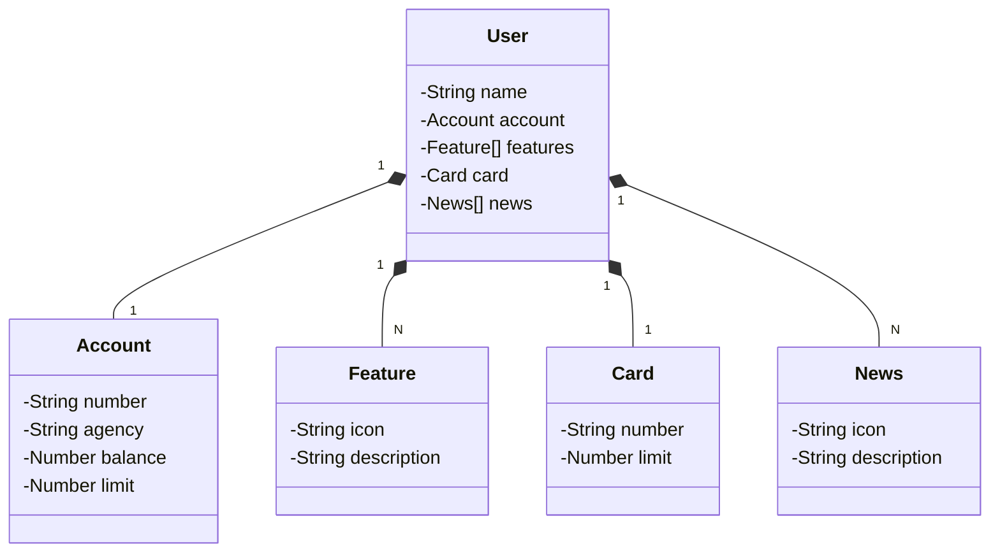

# Java RESTful API for managing users.


This project is an API built using **Java, Java Spring Boot, Postgres. **

Database and application service uses Railway cloud platform.

- Java 17
- Spring Boot 3 
- H2 (local) 
- PostgreSQL (production) 
- Railway 
- OpenAPI (Swagger) 
- CI/CD direct from GitHub 

The API manages user records, accounts, cards, and provides news and resources, and demonstrates how to set up an application to run the application and database on the Railway cloud platform. Build and deployment updates are automated with the platform's integration with GitHub.
For example, when the repository receives updates, the cloud service automatically generates a new build, according to the configuration, and can perform the deployment automatically.

## Table of Contents

- [Installation](#installation)
- [Configuration](#configuration)
- [Local Usage](#local-usage)
- [Cloud Usage](#cloud-usage)
- [Class Diagram](#class-diagram)
- [API Endpoints](#api-endpoints)
- [Contributing](#contributing)
- [Screenshots](#screenshots)

## Installation

1. Clone the repository:

```bash
git clone https://github.com/jonasfschuh/JavaRESTfulAPI.git
```

notes:

[Spring initializr of this project](https://start.spring.io/#!type=maven-project&language=java&platformVersion=3.2.9&packaging=jar&jvmVersion=17&groupId=io.github.jonasfschuh&artifactId=JavaRESTfulAPI&name=JavaRESTfulAPI&description=Java%20RESTful%20API&packageName=io.github.jonasfschuh.JavaRESTfulAPI&dependencies=web,data-jpa,h2,postgresql)


2. Install dependencies with Maven

## Local-usage

1. Start the application with Maven
2. The API will be accessible at http://localhost:8080/swagger-ui/index.html
3. The H2 Database will be accessible at http://localhost:8080/h2-console
with H2 Database credentials: user: admin password:

## Cloud-usage

1. Create a railway account https://railway.app/, and
2. Create a Postgres database.
3. Set the environment variables of API on IntelliJ as generated by the Postgre container on railway.
4. Logged into railway, configure the integration with github to generate continuous integration and delivery.
5. Create a service in railway. When deploying, the application will build and start the application automatically.

Notes: This service allows you to configure a domain to expose this service and make it accessible outside the container.

6. Below is an example generated in my configuration to access swagger-ui.

Interface for testing with swagger-ui - on railway cloud
https://jfs-2024-api-prd.up.railway.app/swagger-ui/index.html

## Class-diagram

Class generated in the mermaid pattern https://mermaid.js.org/intro/



Example POST data

```
{
  "name": "jonas fernando schuh",
  "account": {
    "number": "1392-7",
    "agency": "1243-2",
    "balance": 300,
    "limit": 6000
  },
  "card": {
    "number": "xxxx xxxx xxxx 0000",
    "limit": 20000
  },
  "features": [
    {
      "icon": "URL",
      "description": "Feature description"
    }
  ],
  "news": [
    {
      "icon": "URL",
      "description": "News description"
    }
  ]
}
```


## API Endpoints

The API provides the following endpoints:

```markdown
    GET /users/{id} - Retrieve a specific user base on its ID
    GET /users - Retrieve a list of all registered users 
    PUT /users/{id} - Update the data of an existing user based on its ID
 DELETE /users/{id} - Delete an existing user based on its ID     
   POST /users - Create a new user and return the create user´s data
```

## Contributing

Contributions are welcome! If you find any issues or have suggestions for improvements, please open an issue or submit a pull request to the repository.

When contributing to this project, please follow the existing code style, [commit conventions](https://www.conventionalcommits.org/en/v1.0.0/), and submit your changes in a separate branch.

## Screenshots

Railway dashboard with CI/CD from github.

Every time a push is made to the main branch of the repository, the application is compiled and deployed automatically.
 

Log details


Postgres running on railway


Public network to access application. 


Retrieve a list of all registered users example


