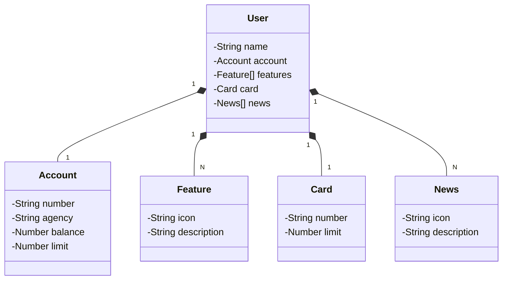

# JavaRESTFulApi
Java RESTFul API with Spring Boot 3, Java 17, PostgreSQL, Railway

Interface for testing with swagger-ui
[swagger-ui](http://localhost:8080/swagger-ui/index.html)

Database - admin/admin
[h2](http://localhost:8080/h2-console)

## Class diagram 

[mermaid](https://mermaid.js.org/intro/)

https://start.spring.io/#!type=maven-project&language=java&platformVersion=3.2.9&packaging=jar&jvmVersion=17&groupId=io.github.jonasfschuh&artifactId=JavaRESTFulApi&name=JavaRESTFulApi&description=Java%20RESTful%20API&packageName=io.github.jonasfschuh.JavaRESTFulApi&dependencies=web,data-jpa,h2,postgresql
